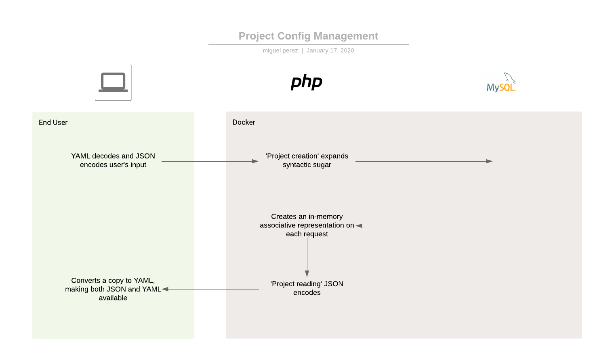

## IMPORTANT TODOs
- stateless computing
	- make sure project creation works on GCRun (simlinks, etc). Run should be stateless.
	- Config should be stored on the DB to keep Run stateless?
- should let me know if DB stops becomming available. Don't just hang there.
	- make sure we get feedback if db couldn´t be created.
	- make sure we get feedback on any sql errors.
	- I get "{"error":"Connection failed: SQLSTATE[HY000] [2002] Operation timed out"}" after too much time
- Should the menu really be generated by the backend?
- Any way to preserve db connection on a session?
- I shouldn't have visibility on projects (sidebar and not sidebar) I'm not user of ¿? does that make sense?
- From the sidebar, show:
	- DBs that are not being managed (should be actionable)
		- can't recreate them atm because they "already exist" so they just take up their name
	- project table entries that don't have a DB (need to be recreated)
- document why I'm calling sidebar_projects twice
- find a way to not need the require once to call db_connection. Check if the connection is open and to the desired db
- Project deletion should export to a dedicated "trash" folder first

- Complete Export/Import feature
	- Export
		- zip file should not remain available, I need to secure it
		- when you have no session, an 'undefined' file is downloaded
		- rethink permissions. Right now I check for a target project SysAdmin session, maybe I should try to sign in (like SSO).
	- Import
		- 1. Create Maker Mike project
		- 2. Copy uploads folder
		- 3. Copy ext files
		- 4. SQL import (DML)
		- 5. unzip themes
		- Implement Drag&drop imports

- Content Export/Import feature
	- Export
		- Dump the sql
		- one file per row
		- specify "INSERT ON DUPLICATE KEY UPDATE"
		- format values so they all start on new lines
		- commands to consider:
```
	mysqldump -h 172.17.0.2 --xml --no-create-info -u root -p miguelp | grep -n '<table_data name="[_a-z0-9]*">'
	csplit origin.txt '/<row/' {*}
```
		- flags to consider
			- --add-drop-database
	- Import 
		- Should be a matter of importing every file
		- commands to consider:
			- mysql -e "source /path-to-backup/backup-file.sql" db_name

## General TODOs
- annimations on both menus should probably match
- May move to GCP?
	- https://cloud.google.com/sql/docs/mysql/connect-run
	- https://cloud.google.com/storage/docs/reference/libraries#client-libraries-install-php
	- https://cloud.google.com/storage/docs/uploading-objects#storage-upload-object-php
- theme autodeploy? filesystem watch service? support users to mount volumes?
- extending the projects from within, issuing create table statements?
- should access to reference imply access to referenced column?
- encript passwords in db
- Figure out a way to create content that is not published, sucerely (possibly the where parameter on the read service)
- Revise logging, currently only using error_log
- SYNDICATION ?
- setup ace editor for php if it's not, can I have php autocompletions?
- check if page and theme url availability need adjustments due to case sensitivity
- verify session on pages from page table? would need to be able to mark pages as private as well
- I need a better logo
- use unlimited column types (will affect db creation) for html
- I should allow for back and forward browser button functionality at index.php (you can't currently reach the same tab you were on)
- create copy on edit
- only preview or don't show even don't show html field on datatable.
- should file size limit be a per project setting? (do I need per project settings?) same thing with input height threadholds
- create test suite
- incorporate OAuth 2.0 for Google accounts
- hide project specific disabled sidebar links 
- front end project config builder?
- use websockets?
- time column on projects?
- confirm project deletions
- dont use the light blue color on the plus/times button
- ctrl+s or cmd+s to save on ace editor
- tab to unfocus on ace editor
- CD? https://cloud.google.com/run/docs/continuous-deployment
- get the logs (2 sources)
	- tail -f /var/log/apache2/php_errors.log
	- the normal ./start
- take jQuery out of the web app?
- verify the ace editor resize timeout
- Connect to Cloud SQL over private IP (doesn't look like it's possible yet)
- jQuery extension client library
	- client demonstration tool?
	- migrate the web app to use the JS client library
	- should the client handle authentication (get and set) as well?
- move images and files to gcs to make Run stateless

## Documentation TODOs
- Complete vs Content Export/Import feature as well as use cases or development patterns
- Diagrams
	- YAML to JSON and JSON to YAML conversion on MM project creations (from scratch and copied from the datatable)
	- Import/Export feature
	- DB, MM DB entry and FS on project creation an deletion based on project name 
	- document config cache. Abreviated non associative yaml is passed on to PHP, which filles in defaults and stores it in the DB. PHP then reads it back and makes it associative. TODO where?, that then workes as a cache and at some point TODO configs are passed to the front end.
- Deploying to GCP (explain whole GCP migration). Should be using the "--prod-mode" flag on entry.sh
- document OAuth
- Creating portlets and pages
- Themes
	- can create a theme within another
- YAML config
	- "display: html" columns
	- Specify valid file extensions¿?
	- Permissions
		- defaults
		- dash vs 'dot star'
		- columns and table levels
	- _show fields
	- select: multi
	- select: tables (requires no type attribute)
	- booleans
	- text fields with 260+ length will be displayed as an ace editor on the front end as per web/src/js/script.js 
	- `user` and `user_type` tables are always added if they don´t exist, while `page`, `portlet` and `theme`are added if the database being created isn´t the maker_mike one.
- show paramter
- where parameter, other params
- Cloud SQL
	- deployment script or steps
	- create Cloud SQL instance
	- authorize your network (if necessary)
	- use DB credentials on the docker run command
	$sudo docker run --rm -p 80:80 IMAGE_HASH /home/entry.sh -h 35.232.214.58 -P DB_PWD

## Maker Mike 1.0.2

### Running maker mike locally
To run on bare metal:
	./start.sh # will start mysql and php dev server.
- You should have mysql installed and available on your PATH ('/usr/local/mysql/bin' is typical on a mac)
- Check ./start.sh usage with "-h"

For docker:
having done a 
```
docker pull mysql/mysql-server:5.7
```
do:
```
	docker run -e "MYSQL_ROOT_HOST=%" -e "MYSQL_ROOT_PASSWORD=admin" --rm -p 3306:3306 mysql/mysql-server:5.7
	docker inspect [CONTAINER HASH] | grep '                    "IPAd'
	cd docker
	docker build .
	sudo docker run -v $PWD/..:/usr/share/nginx/html --rm -p 80:80 IMAGE_HASH /home/entry.sh -h [DB_HOST]
```

### CRUD service extension mechanism
The logic is written on the "src/ext.inc.php" file, which is required by all CRUD services:
- src/crud_create.php
- src/crud_read.php
- src/crud_update.php
- src/crud_delete.php

CRUD extentions are .php files named as either [TABLE_NAME].[POSTFIX].php if located in a specific project or [PROJECT_NAME|-].[POSTFIX].php if located in /src. The POSTFIX can be one of "c", "r, "u" and "d".
"src/ext.inc.php" will search for CRUD service extentions in 3 places in this order:
- project specific: /projects/[PROJECT_NAME]/admin/ext/[TABLE_NAME].[POSTFIX].php
- from "/src" with an unspecified project. Ex: "/src/-.theme.c.php" or "/src/-.page.u.php"
- from "/src" with a specific project. Ex: "/src/maker_mike.project.c.php"

### CRUD services

#### Request origin check
CRUD services check if they have required by the backend itself by checking the $invoked_from_backend variable and then $GET_PARAMS and $POST_PARAMS if needed.
This is usefull so backend services can call each other without the need of new http requests while still being able to share their parameters.

#### File uploads
There are 3 file size limit configurations:
- nginx.conf: defaults to 1 MB, I have it at 10 MB
- php.ini: defaults to 2MB, I have it at 10 MB
- crud_create.php: custom code, I have it at 10 MB

File extentions are limited to 'jpg', 'jpeg', 'gif' and 'png' at the moment by crud_create.php.

### Discovery endpoint
"src/discovery.php" is copied over to each project at creation time by "./build_pre.sh". It returns JSON output with all the configuration data that the front end client needs to build itself. Security checks are made on the backend by "src/discovery.php".

### Transactions
Often times you will need a set of operations run agains the DB to be atomic. The should be run from the backend. This is an example. 
```
<?php 
	$invoked_from_backend = true;
	$GET_PARAMS['project'] = 'miguelp';
    $_GET = $GET_PARAMS;
	require_once $_SERVER["DOCUMENT_ROOT"].'/src/load_config.php';
	require_once $_SERVER["DOCUMENT_ROOT"].'/src/db_connection.inc.php';

    try {
    	$pdo->beginTransaction();

		$GET_PARAMS['table'] = 'award';
		require '../../src/crud_read.php';
		echo '<br>';

		$GET_PARAMS['table'] = 'link';
		require '../../src/crud_read.php';

		$POST_PARAMS['title'] = 'this is a title';
		$POST_PARAMS['description'] = 'this is a description';
		require '../../src/crud_create.php';

	    $POST_PARAMS['id'] = 4;
		$POST_PARAMS['description'] = 'this is the decription num 4';
		require '../../src/crud_update.php';

		require '../../src/crud_delete.php';

        $pdo->commit();
    } catch (PDOException $e) {
        $pdo->rollBack();
        error_log('PDO ERROR: '.$e->getMessage());
        exit();
    }
?>
```
### Project Configuration

- `set_config_and_params.inc.php` creates associative representation
- `maker_mike.project.c.php` fills in syntactic sugar:
	- default tables
		- specified by the table's name as a string (instead of an object)
		- will be replaced by an object containing:
			- their own "name"
			- "columns" array with:
				- "name: 512"
				- "description: 1024"
			- set of permissions
	- default columns
		- specified by the column's name as a string (instead of an object)
		- will be replaced by an object containing:
			- their own "name"
			- "type: 512"
			- set of permissions

### Recreating the main "maker_mike" project
- you will loose all project table entries on the maker tab, so projects will be in a limbo as the dabases will continue to exist. Should show up on sidebar TODO only if you are an admin.
- run your maker_mike yaml on the maker tab, currently:
```
name: maker_mike
tables:
- name: project
  columns:
  - name
  - name: config 
    type: JSON 
  - description
- settings
```
- for the "maker_mike" projectName(only for that one? TODO), build_pre.sh will add in a soft link to enable the home page
- the entry from the project table, the project folder on the FS and the DB can't be deleted as per blacklisting on backend extention maker_mike.project.d.php
- Note: on entry.sh, the maker_mike DB file is run against the DB but data is only written if the database doesn´t already exist.

#### start.sh
- checks if web port is free
- checks if db port is listening and restarts db if not
- creates start_settings.inc.php
- starts the php server and opens the url for you

### When you click 'submit' on the Maker 'projects' tab
- web/src/index.php sends the form data to itself (first transforming the config field data into json), which then:
	- runs ./build_pre.sh projectName db_host db_user db_pass imageTables, which:
		- recreates the project folder
		- creates soft links to index, discovery and login.
		- creates individual upload folders for tables with files, and one for all service extensions
	- writes projectName/projectName.sql
	- runs ./build_post.sh projectName db_host db_user db_pass imageTables, which
		- creates the database

## Front end

### Front end extention mechanisms
- Available hooks (2) on web/src/index.php TODO 
- Displaying HTML on page (display = 'html';) (see page.r.php and theme.r.php) TODO

### JS yaml library used
https://www.npmjs.com/package/yamljs

## Notes
- To change mysql port: sudo vi /Library/LaunchDaemons/com.oracle.oss.mysql.mysqld.plist
- One liner to find a string in all files recursively:
$ grep -rn . -e 'STRING'
- One liner to find a string in all php files:
$ grep --include=\*.php -rn . -e 'STRING'
- Clean docker out with:
docker ps -aq | xargs docker rm -f
docker images -q | xargs docker rmi -f
docker volume list -q | xargs docker volume rm -f
- to get a list of php file dependencies, you can run:
$ find . -type f -name "*.php" | xargs grep -n -e 'require\([[:space:]]\|(\)' | grep -v ./web/projects/ | sed -e 's/:.*require/ ->/' -e 's/;[[:space:]]*\(\?>\)*$//' -e 's/^\.\///'