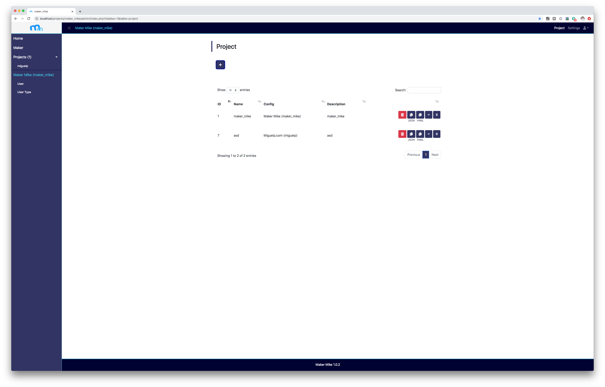

## Maker Mike 1.0.2


### Running Maker Mike

#### Docker
having done a 
```
docker pull mysql/mysql-server:5.7
```
do:
```
docker run -e "MYSQL_ROOT_HOST=%" -e "MYSQL_ROOT_PASSWORD=admin" --rm -p 3306:3306 mysql/mysql-server:5.7
docker inspect [CONTAINER HASH] | grep '                    "IPAd'
docker build . -f docker/Dockerfile
sudo docker run --rm -p 80:80 IMAGE_HASH /home/entry.sh -h [DB_HOST]
```

#### Bare Metal
	./start.sh # will start mysql and php dev server.
- You should have mysql installed and available on your PATH ('/usr/local/mysql/bin' is typical on a mac)
- Check ./start.sh usage with "-h"

#### start.sh
- checks if web port is free
- checks if db port is listening and restarts db if not
- creates start_settings.inc.php
- starts the php server and opens the url for you

### CRUD services

#### Extension mechanism
The logic is written on the "src/ext.inc.php" file, which is required by all CRUD services:
- src/crud_create.php
- src/crud_read.php
- src/crud_update.php
- src/crud_delete.php

CRUD extentions are .php files, they have a postfix which can be one of "c", "r, "u" and "d".
"src/ext.inc.php" will search for CRUD service extentions in 3 places in this order:
- project local: /projects/[PROJECT_NAME]/admin/ext/[TABLE_NAME].[POSTFIX].php
- global with a specified project: Ex: "/src/[PROJECT_NAME].project.[POSTFIX].php"
- global witohut a specified project: Ex: "/src/-.theme.[POSTFIX].php" or "/src/-.page.[POSTFIX].php"

#### Request origin check
CRUD services check if they have required by the backend itself by checking the $invoked_from_backend variable and then $GET_PARAMS and $POST_PARAMS if needed.
This is usefull so backend services can call each other without the need of new http requests while still being able to share their parameters.

#### File uploads
There are 3 file size limit configurations:
- nginx.conf: defaults to 1 MB, I have it at 10 MB
- php.ini: defaults to 2MB, I have it at 10 MB
- crud_create.php: custom code, I have it at 10 MB

#### Transactions
Often times you will need a set of operations run agains the DB to be atomic. The should be run from the backend. This is an example. 
```
<?php 
	$invoked_from_backend = true;
	$GET_PARAMS['project'] = 'miguelp';
    $_GET = $GET_PARAMS;
	require_once $_SERVER["DOCUMENT_ROOT"].'/src/load_config.php';
	require_once $_SERVER["DOCUMENT_ROOT"].'/src/db_connection.inc.php';

    try {
    	$pdo->beginTransaction();

		$GET_PARAMS['table'] = 'award';
		require '../../src/crud_read.php';
		echo '<br>';

		$GET_PARAMS['table'] = 'link';
		require '../../src/crud_read.php';

		$POST_PARAMS['title'] = 'this is a title';
		$POST_PARAMS['description'] = 'this is a description';
		require '../../src/crud_create.php';

	    $POST_PARAMS['id'] = 4;
		$POST_PARAMS['description'] = 'this is the decription num 4';
		require '../../src/crud_update.php';

		require '../../src/crud_delete.php';

        $pdo->commit();
    } catch (PDOException $e) {
        $pdo->rollBack();
        error_log('PDO ERROR: '.$e->getMessage());
        exit();
    }
?>
```

File extentions are limited to 'jpg', 'jpeg', 'gif' and 'png' at the moment by crud_create.php.

### Project Creation
When you click 'submit' on the Maker 'projects' tab:
- web/src/index.php sends the form data to itself (first transforming the config field data into json), which then:
	- runs ./build_pre.sh projectName db_host db_user db_pass imageTables, which:
		- recreates the project folder
		- creates soft links to index, discovery and login.
		- creates individual upload folders for tables with files, and one for all service extensions
	- writes projectName/projectName.sql
	- runs ./build_post.sh projectName db_host db_user db_pass imageTables, which
		- creates the database

#### Project Configuration Management

- `set_config_and_params.inc.php` creates associative representation
- `maker_mike.project.c.php` fills in syntactic sugar:
	- default tables
		- specified by the table's name as a string (instead of an object)
		- will be replaced by an object containing:
			- their own "name"
			- "columns" array with:
				- "name: 512"
				- "description: 1024"
			- set of permissions
	- default columns
		- specified by the column's name as a string (instead of an object)
		- will be replaced by an object containing:
			- their own "name"
			- "type: 512"
			- set of permissions

#### Recreating the main "maker_mike" project
- you will loose all project table entries on the maker tab, so projects will be in a limbo as the dabases will continue to exist. Should show up on sidebar TODO only if you are an admin.
- run your maker_mike yaml on the maker tab, currently:
```
name: maker_mike
tables:
- name: project
  columns:
  - name
  - name: config 
    type: JSON 
  - description
- settings
```
- the entry from the project table, the project folder on the FS and the DB can't be deleted as per blacklisting on backend extention maker_mike.project.d.php
- Note: on entry.sh, the maker_mike DB file is run against the DB but data is only written if the database doesn´t already exist.

## Front end

### Front end extention mechanisms
- Available hooks (2) on web/src/index.php TODO 
- Displaying HTML on page (display = 'html';) (see page.r.php and theme.r.php) TODO

#### Discovery endpoint
"src/discovery.php" is copied over to each project at creation time by "./build_pre.sh". It returns JSON output with all the configuration data that the front end client needs to build itself. Security checks are made on the backend by "src/discovery.php".

### JS yaml library used
https://www.npmjs.com/package/yamljs

## Notes
- To change mysql port: sudo vi /Library/LaunchDaemons/com.oracle.oss.mysql.mysqld.plist
- One liner to find a string in all files recursively:
$ grep -rn . -e 'STRING'
- One liner to find a string in all php files:
$ grep --include='\*.php' -rn . -e 'STRING'
- Clean docker out with:
docker ps -aq | xargs docker rm -f
docker images -q | xargs docker rmi -f
docker volume list -q | xargs docker volume rm -f
- to get a list of php file dependencies, you can run:
$ find . -type f -name "*.php" | xargs grep -n -e 'require\([[:space:]]\|(\)' | grep -v ./web/projects/ | sed -e 's/:.*require/ ->/' -e 's/;[[:space:]]*\(\?>\)*$//' -e 's/^\.\///'